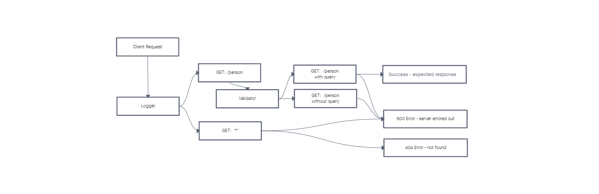

# LAB 02: Basic Express Server

## Author: Daniel Frey

## Problem Domain

A basic server to practice middleware and testing.

## Links and Resources

- [ci/cd](https://github.com/DSFrey/basic-express-server/actions)
- [server url]()

## Setup

### `.env` requirements

- `PORT` - Port Number

### How to initialize/run your application

- `npm start`

### UML

